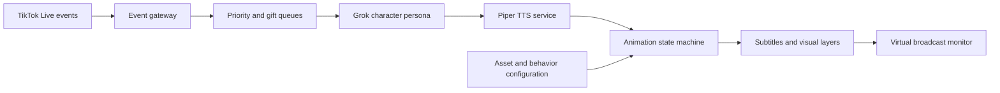

# CapyOwlCat

**A real-time autonomous AI character system for interactive live content.**

[Portfolio](https://www.danil-nikolin.dev)

CapyOwlCat transforms live audience interactions into contextual speech and synchronized visual behavior.

The system receives TikTok Live comments and gifts, prioritizes incoming events, generates in-character responses with Grok, synthesizes speech through a local Piper TTS service, and coordinates layered character animations through a timeline-driven state machine.

It was built as a completed, local-first streaming system rather than a static chatbot or pre-recorded animation.

## System pipeline



## Core capabilities

### TikTok Live integration

- Connects to a TikTok Live room
- Receives chat messages and gift events
- Maintains a bounded in-memory event queue
- Converts gifts into configurable tiers and combo counts
- Supports priority reactions that can interrupt the normal idle cycle
- Includes manual triggers for testing without an active stream

### Contextual AI character

- Uses an explicit character persona rather than generic assistant behavior
- Maintains a bounded conversational history
- Generates short, stream-friendly responses
- Preserves the viewer name and source message
- Produces structured metadata for downstream visual behavior
- Keeps model credentials on the server

### Local text-to-speech

A dedicated Python FastAPI service runs Piper TTS locally.

- Voice models are loaded and cached on demand
- Available voices are exposed through an API
- Generated speech is streamed back as WAV audio
- Voice selection is configurable through the control interface
- The character can continue with text-only behavior if speech generation fails

### Timeline-driven animation engine

The player uses explicit states instead of switching media files arbitrarily:

```text
idle → idle animation → transition in → talk loop → transition out
                                      ↘ gift / emotion reaction
```

Transitions are triggered at configured timeline points, allowing the system to move between loops without abrupt visual cuts.

The engine coordinates:

- Idle loops and weighted idle variations
- Talking loops synchronized with generated audio
- Transition-in and transition-out clips
- Gift reactions based on tier and combo count
- Emotion-specific reactions
- Priority interruptions
- Subtitle timing and typewriter effects
- Background music and layered visual elements

### Asset-management workspace

The built-in operator interface manages:

- Idle animation groups
- Conversation transitions
- Gift reactions
- Emotion groups
- Voice selection
- Background music and volume
- Static visual layers
- Per-layer color correction
- Monitor position and perspective
- Asset availability and upload state

### Broadcast preparation

- Virtual 9:16 safe-zone monitor
- Layer positioning and perspective tuning
- Chroma-key processing through FFmpeg
- Temperature, tint, hue, saturation, brightness, and contrast controls
- Subtitle overlays
- Debug panels for playback state and timing
- Configurable background audio

## Architecture highlights

### Typed application state

A typed Zustand store contains the player state, animation configuration, event queues, monitor settings, voices, colors, and active stream event.

Three.js or canvas rendering is not required: the broadcast composition is built from synchronized browser video and visual layers.

### Separated playback responsibilities

The player is decomposed into focused modules:

- Timeline engine
- Playback transition handlers
- Background-music controller
- Video-layer renderer
- Subtitle overlay
- Color-filter layer
- Debug interface
- Media-selection helpers

This keeps timing and transition logic separate from the main React view.

### Event priority model

Chat responses, gifts, manual triggers, and idle behavior compete for the same character. The queue and state machine decide when an event can interrupt playback and when it must wait for a safe transition point.

### Local-first media architecture

Large voice models and character media assets remain local and are intentionally excluded from the repository. The source code contains the orchestration system, configuration APIs, media processing, and player logic without publishing licensed or oversized production assets.

## Reliability considerations

- Event queues are bounded to prevent unlimited memory growth
- Conversation history is truncated
- Playback helpers handle browser media-play failures
- Timers and listeners are cleaned up when components unmount
- Panic mode stops normal event processing
- Missing TTS audio falls back to visual and text behavior
- Gift reactions preserve counts when several matching events arrive
- Large media and voice models are excluded from Git history
- Server-side API keys are never sent to the browser

## Tech stack

| Layer | Technology |
| --- | --- |
| Application | Next.js 16, React 19, TypeScript |
| State management | Zustand |
| AI character | xAI Grok |
| Live events | TikTok Live Connector |
| Speech | Python, FastAPI, Piper TTS |
| Media processing | FFmpeg |
| UI | Tailwind CSS, Lucide React |
| Configuration | Local JSON-backed APIs |
| Playback | Browser audio/video APIs, timeline state machine |

## Project status

CapyOwlCat is a completed local-first streaming prototype.

The orchestration code, control interface, player, TikTok integration, TTS service, and media-processing pipeline are included. Character videos and Piper voice models are excluded because of file size and licensing constraints.

The project is designed for a single operator running a live character locally. It is not positioned as a multi-tenant cloud platform.

## Local development

### 1. Install the Next.js application

```bash
npm install
```

Create `.env.local`:

```env
XAI_API_KEY=your_xai_api_key
```

### 2. Configure the local TTS service

```bash
cd tts-service
python -m venv .venv
.venv\Scripts\activate
pip install -r requirements.txt
python download_voices.py
```

### 3. Start both services on Windows

```bat
start.bat
```

This launches:

- Piper TTS on `http://127.0.0.1:8000`
- Next.js on `http://localhost:3000`

Production media assets must be added locally through the asset-management workflow.

---

Built end to end by [Danil Nikolin](https://www.danil-nikolin.dev).
